# 🧠 Mindmap Generator - Agentic System

## Overview

This is a completely refactored version of the Mindmap Generator that uses a **multi-agent architecture** for document processing. The system employs specialized AI agents that work together to transform documents into hierarchical mindmaps.

## 🎯 Key Features

- **Modular Agent System**: Specialized agents for different tasks
- **Parallel Processing**: Concurrent extraction for better performance  
- **Provider Agnostic**: Works with OpenAI, Anthropic, DeepSeek, and Gemini
- **Smart Caching**: Reduces redundant API calls
- **Rich Console Output**: Beautiful progress tracking and reports
- **Claude Code Integration**: Can be used as a `/mindmap` command

## 🏗️ Architecture

```
MindmapOrchestrator
    ├── DocumentAnalyzer      # Document type detection & chunking
    ├── TopicExtractor        # Main topic extraction
    ├── SubtopicExtractor     # Subtopic generation (parallel)
    ├── DetailExtractor       # Detail extraction (parallel)
    ├── VerificationAgent     # Reality checking & deduplication
    └── VisualizationAgent    # Mermaid, HTML, Markdown generation
```

## 🚀 Installation

```bash
# Using uv (recommended)
source .venv/bin/activate
uv sync

# Configure API keys in .env
OPENAI_API_KEY=sk-...
ANTHROPIC_API_KEY=...
DEEPSEEK_API_KEY=...
GEMINI_API_KEY=...
```

## 📖 Usage

### Interactive Mode

```bash
python src/main.py
```

### Command Line

```bash
# Single file
python src/main.py document.md --provider OPENAI

# Batch processing
python src/main.py "*.md" --batch --provider ANTHROPIC --output results/

# Specify output directory
python src/main.py doc.txt --output my_mindmaps/
```

### As Python Module

```python
from src.claude_integration import mindmap_command

result = mindmap_command(
    "path/to/document.md",
    provider="OPENAI",
    output_dir="mindmap_outputs"
)

if result['success']:
    print(f"Generated mindmap with {result['statistics']['nodes']['topics']} topics")
    print(f"Cost: ${result['statistics']['token_usage']['total_cost']:.4f}")
```

### Claude Code Integration

Use directly in Claude Code:

```python
from src.claude_integration import mindmap_command

# Generate from file
result = mindmap_command("/path/to/doc.md")

# Generate from text
result = mindmap_command(
    "Your document text here...",
    is_file=False,
    provider="ANTHROPIC"
)
```

## 🔧 Agent Details

### DocumentAnalyzer
- Detects document type (Technical, Scientific, Legal, Business, Academic, Narrative)
- Creates intelligent overlapping chunks
- Adapts chunk size based on document length

### TopicExtractor  
- Extracts 3-12 main topics
- Uses fuzzy matching to prevent duplicates
- Adapts prompts based on document type

### SubtopicExtractor
- Generates 2-6 subtopics per topic
- Runs in parallel for all topics
- Maintains hierarchical relationships

### DetailExtractor
- Extracts 2-5 concrete details per subtopic
- Includes evidence, examples, and specifics
- Processes all subtopics concurrently

### VerificationAgent
- Reality checks against source document
- Aggressive deduplication at all levels
- Preserves only verified, unique content

### VisualizationAgent
- Generates Mermaid mindmap syntax
- Creates interactive HTML with live editor link
- Produces clean Markdown outline
- Auto-selects appropriate emojis

## 📊 Output Formats

### Mermaid Diagram (.mmd)

```mermaid
mindmap
    ((📄))
        ((🎯 Main Topic))
            (📌 Subtopic 1)
                [💡 Detail 1]
                [⭐ Important detail]
            (📌 Subtopic 2)
                [📍 Detail 2]
```


### Interactive HTML (.html)
- Live Mermaid rendering
- Export to SVG
- Edit in Mermaid Live Editor
- Responsive design

### Markdown Outline (.md)
```markdown
# 🎯 Main Topic

## 📌 Subtopic 1
- 💡 Detail 1
- ⭐ Important detail

## 📌 Subtopic 2
- 📍 Detail 2
```

## 🧪 Testing

```bash
# Run tests
pytest tests/ -v

# Run specific test
pytest tests/test_basic.py::test_document_analyzer
```

## 🔍 Performance

Processing phases with progress tracking:
1. **Document Analysis** - Type detection and chunking
2. **Topic Extraction** - Main themes identification
3. **Subtopic Extraction** - Parallel processing
4. **Detail Extraction** - Concurrent detail mining
5. **Verification** - Reality checking and deduplication
6. **Visualization** - Multi-format output generation

Typical performance:
- 10-page document: ~30-60 seconds
- Token usage: 5,000-15,000 tokens
- Cost: $0.01-0.05 (depending on provider)

## 🤝 Contributing

The agentic architecture makes it easy to:
- Add new agent types
- Implement new providers
- Enhance existing agents
- Add output formats

## 📄 License

MIT License

## 🙏 Credits

Refactored from the original [mindmap-generator](https://github.com/Dicklesworthstone/mindmap-generator) into an agentic system by Ылша.

---

**Note**: This is the agentic version designed for integration with Claude Code and other AI assistants. For the original monolithic version, see the main README.